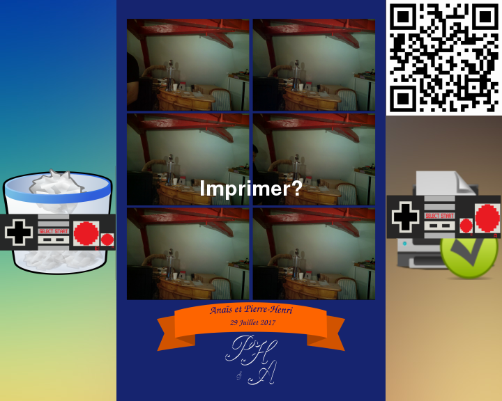
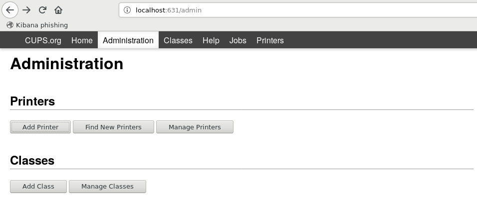

photomaton
-----------


Description
===========

Le photomaton utilisé pour mon mariage. Ce photomaton permet d'imprimer des photos dans une soirée pour environ 0.30€ la photo.

Une série de 6 photos sont prises et assemblées en une seule. L'utilisateur peut choisir d'imprimer ou non la photo. Elle est téléchargeable via un QRCode à tout moment via un point d'accès Wi-Fi ouvert par le photomaton.

Références vers la documentation:

|Guide|Description|
|-----|-----------|
|doc/guide_telechargment|Télécharger les photos sur un smartphone|
|doc/guide_utilisation|Utilisation du photomaton|
|doc/hardware|Fabrication du photomaton|


Screenshots
===========





Hard & soft
===========

|matériel|Version testée|Prix indicatif|
|--------|--------------|--------------|
|Raspberry pi | 2B+ | 30€ |
|picamera |v1.2| 20€ |
|Ecran pour raspberry 10''| | |
|Imprimante Selphy|cp910|100€|
|Relais optocoupleur|SODIAL(R) 5V MODULE 2 CANAUX POUR ARDUINO PIC ARM AVR DSP|1€|

 Des ajustement sur la résolution des images (suivant la picaméra) ou le rendu (suvant l'écran) est à prévoir si le matériel est différent.

|Logiciel|Version testée|URL|
|--------|--------------|---|
|Raspbian|Buster with desktop and recommended software|http://director.downloads.raspberrypi.org/raspbian_full/images/raspbian_full-2019-07-12/2019-07-10-raspbian-buster-full.zip|

INSTALL:
========

1 Télécharger et installer raspbian [Version testée](http://director.downloads.raspberrypi.org/raspbian_full/images/raspbian_full-2019-07-12/2019-07-10-raspbian-buster-full.zip)

2 Installer le socle logiciel

```
sudo "$(curl https://raw.githubusercontent.com/pierrehpezier/photobooth/master/install_stript.sh)"
```
4 Configurer l'imprimante

Se connecter à http://localhost:631/




5 Editer le fichier de configuration

```
vim src/photomaton.conf
```

6 Ajout du hot spot Wi-Fi


5 Redémarrer

```
sudo reboot
```

TODO:
=====

Translate to english
