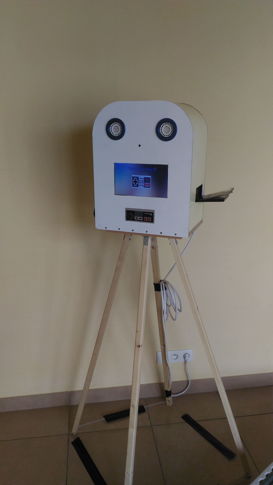
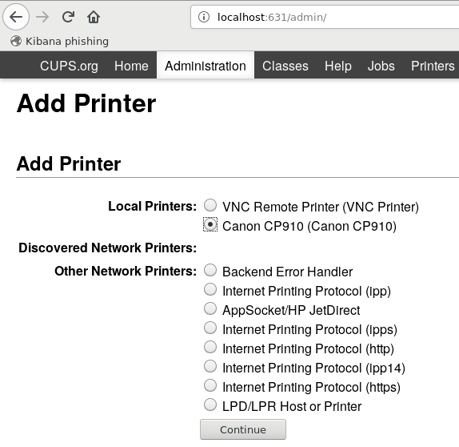
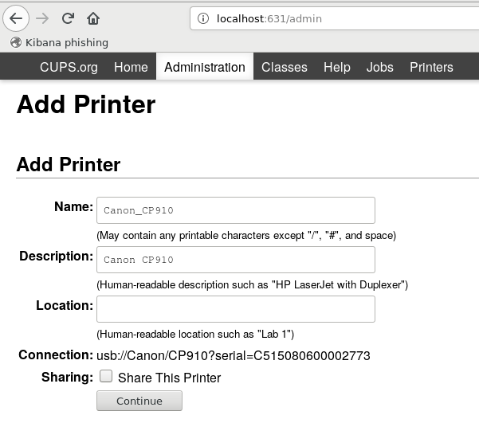
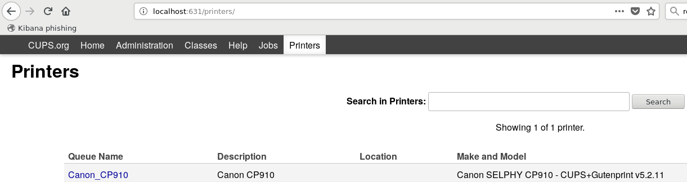

photomaton
-----------



Description
===========

Le photomaton utilisé pour mon mariage. Ce photomaton permet d'imprimer des photos dans une soirée pour environ 0.30€ la photo.

Une série de 6 photos sont prises et assemblées en une seule. L'utilisateur peut choisir d'imprimer ou non la photo. Elle est téléchargeable via un QRCode à tout moment via un point d'accès Wi-Fi ouvert par le photomaton.

voir:
  * doc/Guide de téléchagement.pdf
  * doc/Guide d'utilisation du photomaton.pdf

Screenshots
===========


photomaton
==========

Testé sur:
----------

 * Raspberry pi B
 * Picaméra v1.2
 * Ecran pour raspberry 10"
 * Imprimante Selphy cp910
 * Relais SODIAL(R) 5V MODULE 2 CANAUX POUR ARDUINO PIC ARM AVR DSPDes ajustement sur la résolution des images est à prévoir si le matériel est différent.

avec:
-----

 * Raspbian Buster with desktop and recommended software (http://director.downloads.raspberrypi.org/raspbian_full/images/raspbian_full-2019-07-12/2019-07-10-raspbian-buster-full.zip)
 * LXDE
 * python2

INSTALL:
========

1 Télécharger et installer raspbian [Version testée](http://director.downloads.raspberrypi.org/raspbian_full/images/raspbian_full-2019-07-12/2019-07-10-raspbian-buster-full.zip)

2 Installer le socle logiciel

```
sudo "$(curl https://raw.githubusercontent.com/pierrehpezier/photobooth/master/install_stript.sh)"
```
3 Changer la configuration graphique:

```sudo raspi-config```
select: Advanced options -> Memory split -> and set at least 128MB

4 Configurer l'imprimante

Se connecter à http://localhost:631/









5 Redémarrer

```
sudo reboot
```

TODO:
=====

Translate to english
