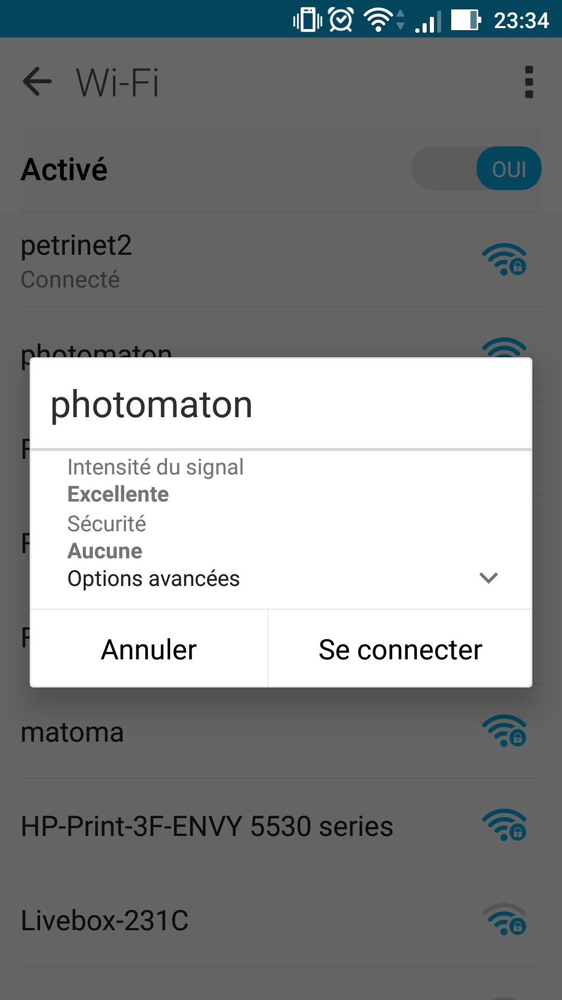
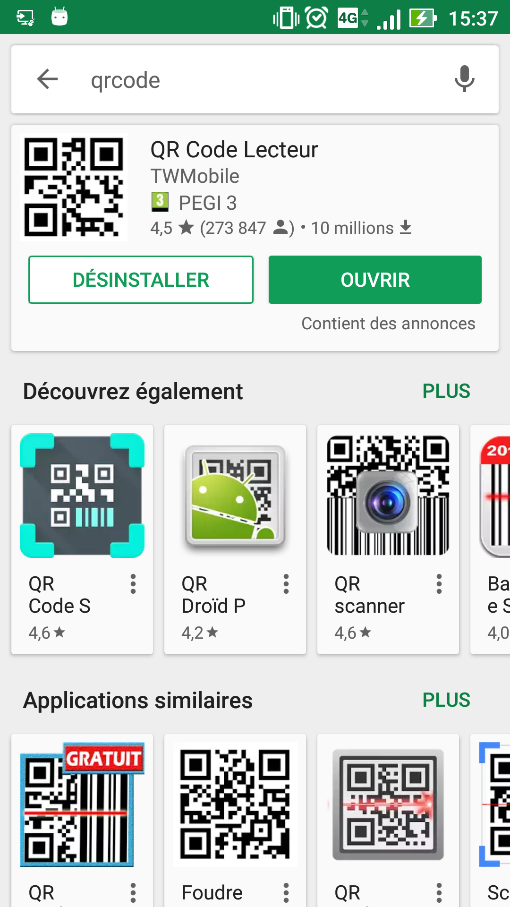

Téléchargement des photos
-------------------------

1 Se connecter au wifi <b>"photomaton"</b> paramètres → Wifi → photomation

2 Installer un logiciel de lecture de qrcode tel que <b>"QR code reader"</b> pour android ou iOS.

3 Scanner le qrcode sur la borne au moment de l’impression

4 Penser à sauver la photo sur son smartphone. Elles ne seront plus accessibles sans le wifi !

<u>Info :</u> Lors du choix d’impression, le qrcode est visible. Il est possible de télécharger sans imprimer.
